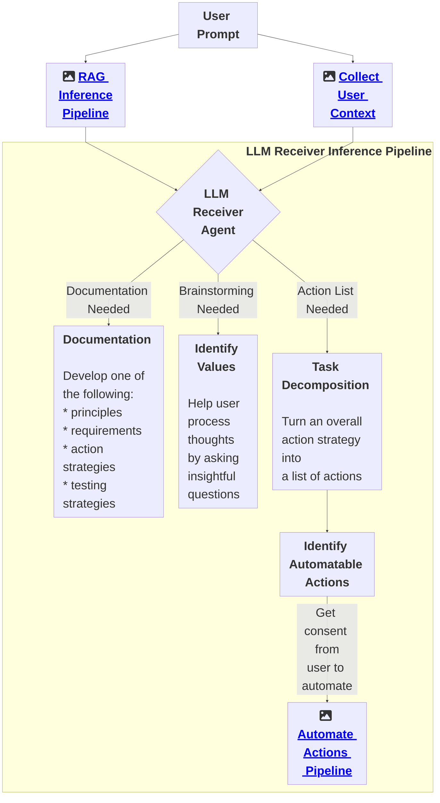

# AI Alignment Liaison

## Overview
The AI Alignment Liaison is a generative AI system designed to advise AI teams on how to align their AI development processes to a set of human values, ethical standards, and compliance requirements. It is a human-in-the-loop platform that guides teams through identifying core values, translating these into potential responsible AI requirements for a given product, strategizing on how to meet each requirement, and strategizing on how to validate that the requirements were indeed met.

## Key Features

### Context Collection
Generates a comprehensive memory database that includes detailed contextual information about the organization. This database serves as a knowledge base of the user’s organization, project, and existing codebase. The depth and quality of this context collection are crucial for providing accurate and relevant guidance.

### Implicit Value Collection
Implicitly gathers an initial set of core values and priorities of the organization. It implicitly collects the organization’s values, providing a high-quality starting point for collaboration. From there, the system will work with the user to establish exactly what values they would like their product development processes to be align with.

### Traceability Tool
Generates mermaid.js flowcharts that visually map the path from value → responsible AI product requirement → action → test. This tool facilitates transparency and accountability in the alignment process.

### Document Development
Works with the user to:
- Write an AI ethics statement.
- Decide on responsible AI requirements for a given product.
- Develop an action plan to meet each requirement.
- Develop a validation strategy to check that each requirement was indeed met.
- Create user stories designed to integrate with existing project management tools like JIRA, Asana, and ClickUp, enabling smooth workflow integration.

### Agent Tooling
Handles the automation of actions within the AI Alignment Liaison system. After generating the necessary documentation and strategies, Agent Tooling executes specific actions, subject to user approval. The system uses APIs for tools built by others to offload the user’s burden.

### Advanced Evaluation & Feedback Strategies
Includes sophisticated mechanisms for evaluating and refining the outputs:
- **LLM-as-a-Judge Methodology**: Utilizes few-shot prompting to align the evaluation of outputs with human judgment.
- **Feedback Loop and Iteration**: Continuously refines outputs through strategies like reinforcement learning from human feedback (RLHF), flow engineering using LangGraph, and feedback intelligence.

## Current Status
The AI Alignment Liaison is in its early stages, focusing on establishing foundational systems and processes. The current development priorities include building the product’s capabilities, integrating with additional tools and platforms, and exploring strategies of compliance and value alignment processes. The project is actively seeking funding and partnerships to support its vision of making responsible AI development accessible to all teams and organizations.

## Contact
For any inquiries or support, please contact Ari Tal at ArealTal@gmail.com.